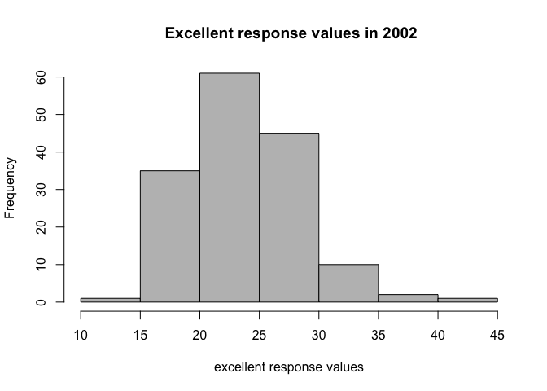
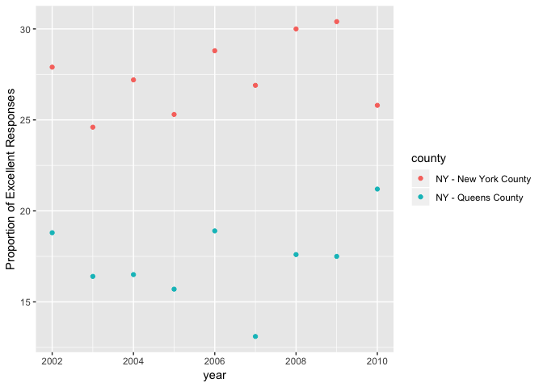

Homework 2
================
*Apoorva Srinivasan*
10/2/2018

    ## ── Attaching packages ───────────────────────────────── tidyverse 1.2.1 ──

    ## ✔ ggplot2 3.0.0     ✔ purrr   0.2.5
    ## ✔ tibble  1.4.2     ✔ dplyr   0.7.6
    ## ✔ tidyr   0.8.1     ✔ stringr 1.3.1
    ## ✔ readr   1.1.1     ✔ forcats 0.3.0

    ## ── Conflicts ──────────────────────────────────── tidyverse_conflicts() ──
    ## ✖ dplyr::filter() masks stats::filter()
    ## ✖ dplyr::lag()    masks stats::lag()

PROBLEM 1
=========

The code chunk below imports NYC transit subway data and performs some manipulation as instructed using select and mutate functions:

``` r
nyc_transit = read_csv(file = "./hw2_data/NYC_Transit_Subway_Entrance_And_Exit_Data.csv") 
```

    ## Parsed with column specification:
    ## cols(
    ##   .default = col_character(),
    ##   `Station Latitude` = col_double(),
    ##   `Station Longitude` = col_double(),
    ##   Route8 = col_integer(),
    ##   Route9 = col_integer(),
    ##   Route10 = col_integer(),
    ##   Route11 = col_integer(),
    ##   ADA = col_logical(),
    ##   `Free Crossover` = col_logical(),
    ##   `Entrance Latitude` = col_double(),
    ##   `Entrance Longitude` = col_double()
    ## )

    ## See spec(...) for full column specifications.

``` r
  nyc_transit = janitor::clean_names(nyc_transit) %>%
    select(line:entry, vending, ada) %>%
    mutate(entry = recode(entry, "YES" = TRUE, "NO" = FALSE ))
```

We're given a dataset containing information about nyc transit subway entrance and exit details. After editing out what is not required for this homework, we now have a new dataset with variable that are line, station name, station lattitude, longitude, route 1 to 11, entrance type, entry, vending and compliance with ADA.

Data cleaning steps:

1.  Imported data using read\_csv through relative path to ensure reproducability
2.  Cleaned the variable names using the janitor function which converted all column names into lower snake case.
3.  Retained the required variables using select to declutter our data.
4.  Converted the entry variable from character to logical variable using recode.

The dimensions of the data set are **1868 x 19.**

-   Are these data tidy?

No, the data doesn't look tidy because the data for the route variable are spread across eleven columns which makes it difficult to read.

*Further questions:*

-   How many distinct stations are there?

``` r
distinct(nyc_transit, line, station_name, .keep_all = TRUE) %>%
  nrow()
```

    ## [1] 465

``` r
#distinct funtion was used here to pick the distinct stations by line and station name
```

There are **465** distinct stations.

-   How many stations are ADA compliant?

``` r
 nyc_transit %>%
  distinct(station_name, line, .keep_all = TRUE) %>% 
  filter(ada == TRUE) %>% 
  nrow()
```

    ## [1] 84

**84** stations are ADA compliant.

-   What proportion of station entrances / exits without vending allow entrance?

``` r
no_vending = nyc_transit %>%
  filter(vending == "NO")
  proportion_no_vending = mean(no_vending$entry == TRUE)
  knitr::kable(proportion_no_vending)
```

|          x|
|----------:|
|  0.3770492|

We can infer that **37.7%** of stations with entrance don't have vending machines.

*Reformating the data*

The code chunk below contains the code for reformating data so route number and route name are distinct variables using separate funtion then then further cleaning by removing a column using select.

``` r
nyc_transit = gather(nyc_transit, key = route_number, value = route_name, route1:route11) %>%
  separate(route_number, into = c("route_str", "route_number"), sep = 5) %>%
  select(-route_str)
```

-   How many distinct stations serve the A train?

``` r
  nyc_transit %>%
  distinct(station_name, line, .keep_all = TRUE) %>%
  filter(route_name == "A") %>%
  nrow() 
```

    ## [1] 60

**60** distinct stations serve the A train

-   Of the stations that serve the A train, how many are ADA compliant?

``` r
nyc_transit %>%
  distinct(station_name, line, .keep_all = TRUE) %>%
  filter(route_name == "A", ada == "TRUE") %>%
  nrow()
```

    ## [1] 17

Of the 60 stations that serve the A train, **17** are ADA compliant.

PROBLEM 2
=========

*Importing and cleaning Mr. Trash Wheel dataset* The code chunk below imports the most recent Mr. Trash Wheel dataset, performs manipulation such as omiting unrequired rows and conversion of variables.

``` r
trash_wheel = read_excel("./hw2_data/HealthyHarborWaterWheelTotals2018-7-28.xlsx", sheet = "Mr. Trash Wheel", range = cell_cols("A:N"), col_names = TRUE) %>%
  janitor::clean_names() %>% 
  #omiting rows that does not include dumpster specific data using ! function
  filter(!(dumpster == "NA")) %>% 
  #rounding off no. of sports balls and converting to an integer variable
  mutate(sports_balls = round(sports_balls)) %>% 
  mutate(sports_balls = as.integer(sports_balls))
```

*Importing and cleaning precipitation data for 2016 and 2017*

``` r
precipitation_2016 = read_excel("./hw2_data/HealthyHarborWaterWheelTotals2018-7-28.xlsx", sheet = "2016 Precipitation", range = "A2:B14", col_names = TRUE) %>%
  janitor::clean_names() %>% 
  rename(precipitation = total) %>% 
  filter(!is.na(precipitation)) %>% 
  mutate(year = 2016)
```

``` r
precipitation_2017 = read_excel("./hw2_data/HealthyHarborWaterWheelTotals2018-7-28.xlsx", sheet = "2017 Precipitation", range = "A2:B14", col_names = TRUE) %>% 
  janitor::clean_names() %>% 
  rename(precipitation = total) %>% 
  filter(!is.na(precipitation)) %>% 
  mutate(year = 2017)
```

*Combining precipitation datasets:*

``` r
precipitation_combined = 
  bind_rows(precipitation_2016, precipitation_2017) %>% 
  mutate(month = month.name[month])
```

Mr. Trash wheel is a water wheel vessel set up in 2014 designed to remove trash flowing down the Jones Fall river in Baltimore state. The data was collected a few times a month from May 2014 through July 2018. The given dataset contains information on dumpster number, date of trash collection, the amount of trash(by weight and volume), it's contents(plastic bottles, cigarette buds,bags etc.) and the approximate number of homes powered using the energy generated from the trash. The key variables would be the **date, amount(by weight and volume) and the number of homes powered.** After cleaning the data, we get a new datset with **285** rows and **14** columns. The approximate total number of homes that were powered by using **934.94** tons of trash collected by Mr. Trash Wheel over the four years are **1.195066710^{4}.**

The precipitation datasets for the year 2016 has **12 rows and 3** columns and for the year 2017 has **12 rows and 3 column.** The mean precipitation for the year 2016 and 2017 is **3.3291667 and 2.7441667** respectively. The key variables for both the datasets are month, corresponding precipitation for that month and the year. The combined precipitation dataset for 2016 and 2017 includes 24 observations for 3 variables. The total precipitation in 2016 and 2017 was **72.88.**

-   For available data, what was the total precipitation in 2017?

``` r
sum(precipitation_2017$precipitation)
```

    ## [1] 32.93

The total precipitation in 2017 is **32.93**

-   What was the median number of sports balls in a dumpster in 2016?

``` r
  trash_wheel %>%  
  filter(year == 2016) %>% 
  pull(sports_balls) %>% 
  median
```

    ## [1] 26

The median number of sports balls in a dumpster in 2016 are **26.**

PROBLEM 3
=========

*Reading and cleaning dataset as instructed*

The code chunk below creates a dataframe using the data from the dataset package given and manipulates as instructed using filter and select. Spread function was used for responses to make it more readable.

``` r
library(p8105.datasets)
#View(p8105.datasets::brfss_smart2010)
brfss_data = p8105.datasets::brfss_smart2010 %>%
  janitor::clean_names() %>%
  rename("state" = locationabbr, "county" = locationdesc) %>% 
  filter(topic == "Overall Health") %>%
  select(-class, -topic, -question, -sample_size, -c(confidence_limit_low:geo_location)) %>%
  spread(key = response, value = data_value) %>%
  janitor::clean_names() %>%
  mutate(excellent_or_verygood = excellent + very_good)
```

*Further questions:*

-   How many unique locations are included in the dataset? Is every state represented?

``` r
brfss_data %>%
  distinct(state) %>% 
  count()
```

    ## # A tibble: 1 x 1
    ##       n
    ##   <int>
    ## 1    51

**All 50 states and 1 US Territory, the District of Columbia are represented in the Table.**

-   What state is observed the most?

``` r
most_obv = brfss_data %>%
  count(state) %>% 
  arrange(desc(n, state)) %>%
  head(1)
```

The most observed state is **NJ, 146**

-   In 2002, what is the median of the “Excellent” response value?

``` r
excellent_2002 =
  brfss_data %>% 
  filter(year == 2002) %>%
  select(excellent) 
```

The median of "excellent" responses in 2002 is **23.6**

-   Make a histogram of “Excellent” response values in the year 2002.

``` r
hist(excellent_2002$excellent, main = " Excellent response values in 2002", xlab = "excellent response values", col = c("grey") )
```



From the graph above, we can see that it follows somewhat of a normal distribution with maximum excellent response rates between 20-25. This means that about that about 20-30% of the population from around 60 different counties in 2002 reported that their overall health was excellent.

-   Make a scatterplot showing the proportion of “Excellent” response values in New York County and Queens County (both in NY State) in each year from 2002 to 2010.

``` r
brfss_data %>%
filter(county %in% c("NY - Queens County", "NY - New York County" )) %>% 
  ggplot(., aes(x = year, y = excellent)) +
  geom_point(aes(color = county)) + 
  labs(main = "Scatterplot showing proportion of Excellent response values in New York County and Queens County", x = "year", y = "Proportion of Excellent Responses")
```



It can be seen that the New York county has higher excellent response values for each year as compared to the Queens county.
